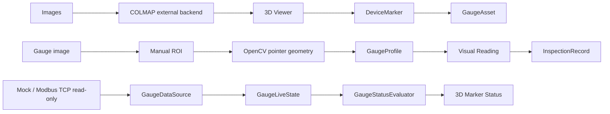
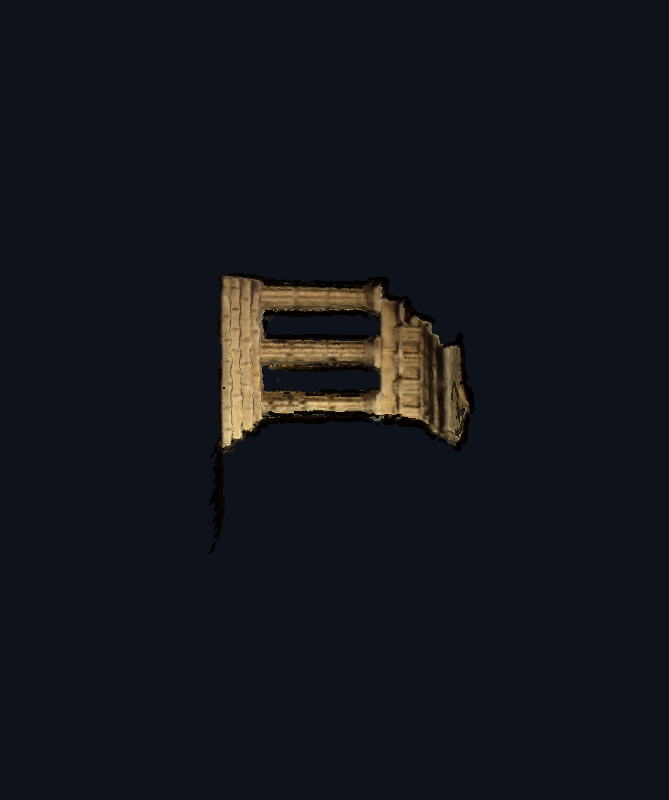
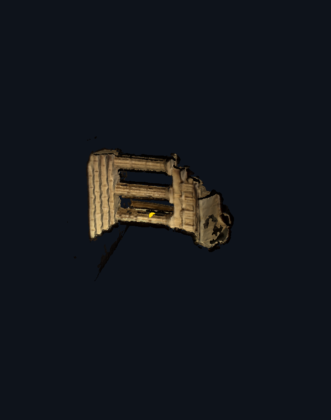
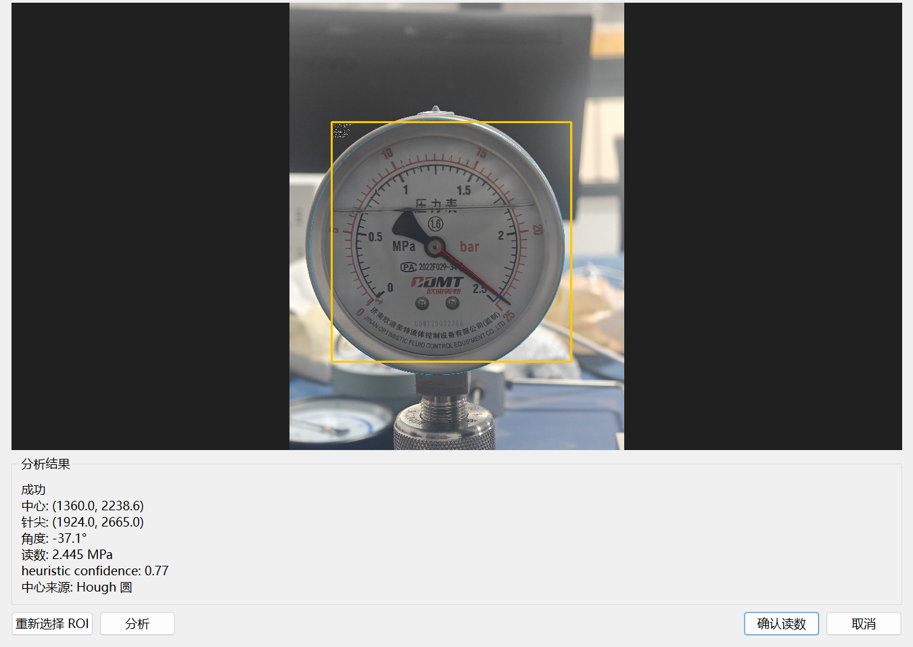
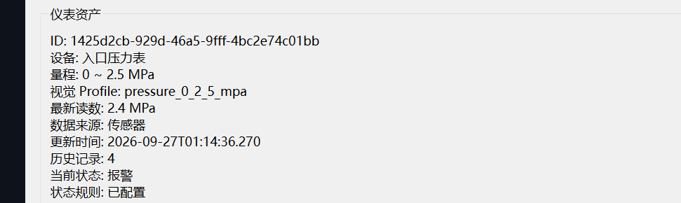
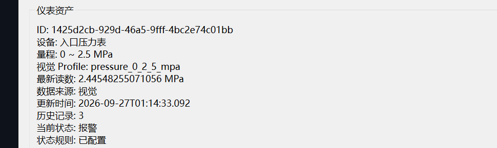
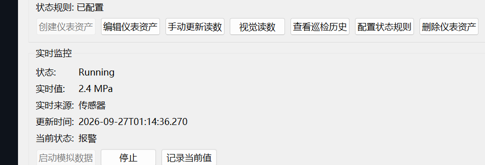

# Three-Dimensional Vision Inspection Platform

## 基于 C++/Qt 的工业设备视觉巡检与三维状态管理系统

中文 | [English](README_EN.md)

这是一个基于 C++17、Qt Widgets、OpenGL 和 OpenCV 的桌面视觉巡检工程。它把多视角图像、外部 COLMAP 重建结果、三维设备标记、仪表资产、视觉读表结果和实时状态放在同一条可追踪链路中。

`v0.3.0` 的主题是 **Gauge Inspection & Realtime Monitoring**。本版本发布正式的 GaugeAsset、人工 ROI 视觉读表、InspectionRecord、状态规则、Mock Sensor 与只读 Modbus TCP 数据源实现，同时保留 `v0.2.0` 的三维查看、相机交互、网格拾取和 DeviceMarker 能力。

## 产品链路



## v0.3.0 功能范围

### GaugeAsset 与三维设备绑定

- `GaugeAsset` 绑定到已有 `DeviceMarker` 的 source-world 位置。
- 示例仪表为 `P01 入口压力表`，量程 `0.0–2.5 MPa`。
- 支持 `Manual`、`Visual`、`Sensor` 三类数据来源。
- 仪表资产、状态规则、数据源绑定和检查记录通过项目 JSON 持久化；实时样本本身保留在运行时状态中。

### 人工 ROI 视觉读表

视觉读表是明确的人工确认流程，不是 AI、YOLO 或完全自动识别：

1. 选择项目图像或外部图像。
2. 人工指定 ROI。
3. 使用 OpenCV 的圆形/指针几何分析得到候选读数。
4. 使用 `GaugeProfile` 的多点插值把指针位置映射为工程量。
5. 在覆盖层中复核结果并确认读数。

视觉检查记录绑定原始 `ImageAsset`，保留图像、ROI、角度、读数和来源信息。

### InspectionRecord 与历史

- Manual、Visual、Sensor 读数使用统一的 `InspectionRecord` 表达。
- 可查看仪表历史记录和当前来源、时间、状态。
- 实时样本不自动写入项目文件；只有显式记录当前值时才形成持久化检查记录。

### GaugeStatus 与三维状态显示

- 状态规则输出 `Unknown`、`Normal`、`Warning`、`Alarm`。
- 三维标记分别使用灰、绿、黄、红表达状态。
- 被选中的标记仍保持可区分的选中表现，不会被状态颜色掩盖。

### 实时数据源

- `GaugeDataSource`、`GaugeSample`、`GaugeLiveState` 和 `RealtimeMonitoringController` 分离数据采集、实时状态和历史记录。
- `MockSensorDataSource` 用于本地演示和客户端烟测。
- `ModbusTcpGaugeDataSource` 是通用的 **只读** Qt SerialBus 适配器，只发送读取请求，不提供 PLC 控制或写入接口。
- Modbus 绑定支持 Holding/Input Registers、`UInt16`、`Int16`、`UInt32`、`Int32`、`Float32`、`ABCD/CDAB` 字节序、scale/offset 和轮询间隔。
- Modbus 数据源已在本地 `QModbusTcpServer` loopback 环境中验证。未对真实 PLC 做验证。

## 运行截图

以下图片均来自真实 Qt 客户端运行过程。新增 v0.3.0 截图裁去了本机路径，只保留功能画面；实时画面明确是 Mock Sensor 演示，不是 Modbus 客户端截图。

### OpenGL 3D Viewer



### Device Marker


### Marker Interaction



### Manual ROI visual gauge reading



### Inspection history and persisted gauge state



### Alarm marker state



### Realtime monitoring with Mock Sensor



## 核心技术实现

### C++ / Qt / OpenCV

- C++17、CMake 3.21+。
- Qt 6 Widgets、OpenGL、OpenGLWidgets、Network、SerialBus 和 Qt Test。
- Qt SerialBus 需要安装与发行版匹配的 Qt SerialPort 依赖；本仓库不携带 Qt 二进制。
- OpenCV 4.x 的 `core`、`imgproc`、`imgcodecs` 模块。
- OpenGL 3.3 Core、GLSL 330、VAO/VBO/EBO。

### 三维与设备域

- 受控 Binary Little Endian PLY Loader 和 CPU 侧 `MeshData`。
- `MeshRenderer` 与 `MarkerRenderer` 分离，CPU Mesh 用于拾取，GPU 资源用于渲染。
- `CameraController` 提供 Orbit、Pan、Zoom、Fit To View 和 Reset View。
- 三角形拾取输出 `SurfaceHit`，当前是 click-level CPU brute-force MVP。
- `DeviceMarker` 使用 source-world 坐标和 reconstruction identity 持久化，避免把屏幕坐标写入业务数据。

### 视觉、记录与实时运行时

- `GaugeProfile`、`VisualGaugeReader` 和人工 ROI 对话框形成视觉读表链路。
- `InspectionRecord` 统一 Manual、Visual、Sensor 记录，并保留视觉记录的原始 `ImageAsset` 绑定。
- `GaugeStatusRule`/`GaugeStatusEvaluator` 把读数或实时样本转换为状态。
- `GaugeLiveState` 保存当前实时样本和连接状态；显式快照才进入持久化记录。
- COLMAP 仍是外部 reconstruction backend，不随仓库分发。

## 项目结构

```text
app/
├─ src/core/assets/       # ImageAsset、资产与缩略图
├─ src/core/device/       # DeviceMarker、GaugeAsset、GaugeProfile、状态规则
├─ src/core/inspection/   # InspectionRecord
├─ src/core/realtime/     # Mock/Modbus 数据源、实时状态与控制器
├─ src/core/vision/       # VisualGaugeReader
├─ src/core/mesh/         # MeshData 与 PLY 网格加载
├─ src/core/geometry/     # Ray、Picking 与 SurfaceHit
├─ src/core/viewer/       # CameraController
├─ src/render/            # MeshRenderer 与 MarkerRenderer
├─ src/widgets/           # Qt Widgets、Gauge 对话框与 3D Viewer
└─ tests/                 # Qt Test targets
docs/images/              # 真实客户端截图
```

## 构建

### 依赖

- Windows 10 或更新版本。
- Visual Studio 2022 / MSVC。
- Qt 6.5 或兼容的 Qt 6 发行版，至少提供 Core、Gui、Widgets、OpenGL、OpenGLWidgets、Network、SerialBus、SerialPort 和 Test。
- OpenCV 4.x；CMake 需要通过 `OpenCV_DIR` 找到包含 `OpenCVConfig.cmake` 的目录，并使用 `core`、`imgproc`、`imgcodecs`。
- CMake 3.21+。
- COLMAP：外部 reconstruction backend，可选配置，不随仓库分发。

### 配置、构建和测试

从仓库根目录执行。路径占位符只表示用户本机的依赖安装位置，不是本项目的固定路径：

```powershell
cmake -S app -B build -G "Visual Studio 17 2022" -A x64 -DCMAKE_PREFIX_PATH="<path-to-Qt-6>" -DOpenCV_DIR="<path-to-opencv-config-directory>" -DBUILD_TESTING=ON -DVISION3DINSPECTOR_BUILD_TESTS=ON
cmake --build build --config Release --target ALL_BUILD
ctest --test-dir build -C Release --output-on-failure
```

直接运行 CTest 时，请确保匹配的 Qt `bin` 目录和 OpenCV runtime `bin` 目录已经在当前进程的 `PATH` 中，或从已配置好 Qt 运行环境的开发工具中运行。维护者发布验证使用 Qt 6.5.3 / MSVC 和 OpenCV 4.14，公共仓库实际验证结果为 **20/20 CTest 通过**。Qt/OpenCV 安装包、运行时 DLL、COLMAP binary、dataset、PLY 模型、训练权重和 reconstruction outputs 均不进入仓库。

## 当前限制与诚实边界

- 当前测试模型仍可能存在 mesh 空洞；三维质量受拍摄和 COLMAP 重建质量影响。
- Mesh Picking 仍是 click-level CPU brute-force，尚未加入 BVH 加速。
- 视觉读表需要人工 ROI 和确认；这是 OpenCV 指针几何 MVP，不是 AI/YOLO/全自动读表系统。
- 开发阶段的小规模调参回归集不是独立验证基准，不据此宣称通用准确率、100% 准确率或工业计量精度。
- Modbus TCP 只读适配器仅在本地 Qt `QModbusTcpServer` loopback 环境验证；真实 PLC、PLC 写入/控制、Siemens/S7、MQTT 均不在本版本范围内。
- 没有物理尺度标定时，world coordinate 是 reconstruction coordinate，不代表毫米级物理坐标。
- 当前界面仍为 Qt Widgets，未进入 QML/安装器/商业化部署阶段。

本版本的三维模块用于空间管理、位置绑定和状态可视化基础；读表和实时监控结果应按其明确的验证边界使用。

## 公开边界与许可证

本仓库只发布正式 C++/Qt 源码、必要的公开技术说明和真实客户端截图。不会包含个人路径、token、password、credential、API key、dataset、PLY mesh、训练权重、缓存、构建产物或第三方二进制包。

项目采用 Apache License 2.0，详见 [LICENSE](LICENSE)。第三方依赖与分发边界见 [THIRD_PARTY_NOTICES.md](THIRD_PARTY_NOTICES.md)。
