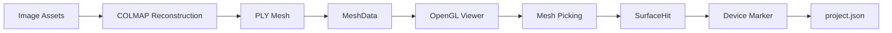

# Three-Dimensional Vision Inspection Platform

## 基于 C++/Qt 的工业设备视觉巡检与三维状态管理系统

中文 | [English](README_EN.md)

本项目是一个基于 C++ / Qt 的工业设备视觉巡检与三维状态管理桌面软件。系统通过多视角图像建立静态三维场景，将仪表、阀门等设备与三维空间位置关联，并提供三维模型查看、空间点选和设备标记管理能力。

v0.2.0 已完成从图像资产管理、外部 COLMAP 重建工作流，到 OpenGL 三维模型显示、交互式相机、三角网格拾取和设备空间标记持久化的基础链路。当前版本展示的是可运行的 C++/Qt 工程基础，不宣称精密测量、实时监控或工业识别精度。

## 当前功能

| 状态 | 功能 |
| --- | --- |
| 已完成 | 项目创建、打开、关闭与项目清单管理 |
| 已完成 | 图像资产导入与缩略图管理 |
| 已完成 | 外部 COLMAP 三维重建工作流集成 |
| 已完成 | 受控 Binary Little Endian PLY 网格加载 |
| 已完成 | OpenGL 3.3 Core 三维模型渲染 |
| 已完成 | Orbit / Pan / Zoom / Reset 相机交互 |
| 已完成 | 三维表面 Picking 与 `SurfaceHit` |
| 已完成 | Device Marker 创建、选择、删除与渲染 |
| 已完成 | `project.json` Marker 持久化与 reconstruction identity 安全 |
| 规划中 | GaugeAsset 与仪表自动读数的正式 Qt 集成 |
| 规划中 | PLC / MQTT / Modbus 数据接入 |
| 规划中 | 三维重建质量优化与 Picking BVH 优化 |
| 规划中 | 更现代化的 Qt Widgets 界面 |

## 运行截图

以下图片来自真实 Qt 客户端运行过程，用于展示模型查看、设备 Marker 与交互状态。

### OpenGL 3D Viewer


### Device Marker


### Marker Interaction


## 核心技术实现

### C++ / Qt

- C++17
- Qt Widgets、Qt Test
- CMake
- 项目、资产、重建任务与 Viewer 之间保持清晰的模块边界

### 三维渲染

- `QOpenGLWidget`
- OpenGL 3.3 Core
- GLSL 330
- VAO / VBO / EBO
- `MeshRenderer` 与 `MarkerRenderer` 分离

### 网格加载

- 自定义受控 Binary Little Endian PLY Loader
- CPU 侧 `MeshData` 用于拾取与几何查询
- 顶点颜色保留
- 缺失法线自动生成
- `BoundingBox` 用于模型范围与视图适配

### Camera

- Orbit
- Pan
- Zoom
- Fit To View
- Reset View

### Picking

屏幕点按经过以下几何链路转换为模型命中结果：

`Qt logical coordinate` → `NDC` → `inverse projection` → `source-world ray` → `Möller–Trumbore` → frontmost `SurfaceHit`

当前 Picking 使用 CPU brute-force 三角形遍历，定位为 click-only MVP。

### Device Marker

- 使用 source-world position，而不是屏幕坐标持久化
- 稳定 Marker ID
- reconstruction task identity 保护坐标关联
- 屏幕空间 Marker 选择
- OpenGL Marker Renderer
- `project.json` 持久化

## 架构概览



## 项目结构

```text
app/
├─ src/core/mesh/       # MeshData 与 PLY 网格加载
├─ src/core/geometry/   # Ray、BoundingBox、Picking 与 SurfaceHit
├─ src/core/viewer/     # 相机控制
├─ src/core/device/     # DeviceMarker 与项目标记模型
├─ src/render/          # MeshRenderer 与 MarkerRenderer
├─ src/widgets/         # Qt Widgets 与 3D Viewer
├─ src/app/             # MainWindow 与应用装配
└─ tests/               # Qt Test targets
docs/images/            # 真实客户端截图
```

## 工程实现亮点

- Viewer 与业务数据解耦。
- `MeshRenderer` 与 `MarkerRenderer` 分离，Marker 变化不会重新上传整份 Mesh。
- `CameraController` 独立于 QWidget，便于单元测试和交互逻辑复用。
- Picking 使用 source-world coordinate，避免把屏幕坐标当成持久化业务数据。
- Marker 以稳定 ID 和重建任务身份关联，避免重建后坐标误绑定。
- 使用 `QSaveFile` 做项目文件的原子写入。
- CPU Mesh 保留用于 Picking，GPU 资源只负责渲染。
- 测试覆盖项目管理、网格加载、相机、Picking、Viewer 与 Marker 核心链路。

## 当前限制

- 当前网格质量受多视角拍摄和 COLMAP reconstruction 质量影响。
- 当前测试模型仍存在部分 mesh 空洞。
- Mesh Picking 当前为 CPU brute-force，适用于 click-only MVP，尚未加入 BVH 加速。
- Gauge 自动读数尚未正式接入 Qt 产品流程。
- PLC / MQTT / Modbus 尚未接入。
- 当前界面仍为 Qt Widgets。
- 没有物理尺度标定时，world coordinate 只是 reconstruction coordinate，不代表毫米级物理坐标。

当前三维模块用于空间管理、位置绑定和状态可视化基础，不宣称精密测量或高精度工业计量。

## 构建环境

- Windows 10 或更新版本
- Visual Studio 2022 / MSVC
- C++17
- Qt 6.5 或兼容 Qt 6 版本（Core、Gui、Widgets、Test）
- CMake 3.21+
- COLMAP：外部 reconstruction backend，不随仓库分发

从仓库根目录执行：

```powershell
cmake -S app -B build -G "Visual Studio 17 2022" -A x64 -DCMAKE_PREFIX_PATH="<path-to-Qt-6>" -DBUILD_TESTING=ON -DVISION3DINSPECTOR_BUILD_TESTS=ON
cmake --build build --config Release
ctest --test-dir build -C Release --output-on-failure
```

当前公开源码注册 13 个 CTest。COLMAP 运行时由用户在本机配置为外部 backend；公开仓库不包含 COLMAP binary、dataset、PLY 模型、模型权重或 reconstruction outputs。

## 运行

构建完成后运行：

```text
build/Release/Vision3DInspector.exe
```

## 公开边界与许可证

本仓库公开正式 C++ / Qt 产品源码和必要技术说明，不包含个人路径、token、password、credential、API key、dataset、训练权重、缓存或构建产物。历史研究边界中的 Gauge 内容不是 v0.2.0 的正式产品功能，也未接入 Qt runtime。

项目采用 Apache License 2.0，详见 [LICENSE](LICENSE)。第三方依赖与分发边界见 [THIRD_PARTY_NOTICES.md](THIRD_PARTY_NOTICES.md)。
