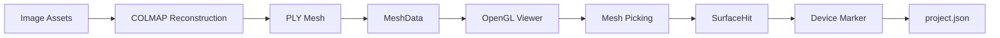

# Three-Dimensional Vision Inspection Platform

## A C++/Qt desktop platform for industrial vision inspection and 3D state management

[中文](README.md) | English

This project is a C++ / Qt desktop application for industrial vision inspection and spatial state management. It builds a static 3D scene from multi-view images, associates devices such as gauges and valves with positions in that scene, and provides model viewing, spatial picking and device-marker management.

v0.2.0 completes the basic path from image assets and an external COLMAP reconstruction workflow to OpenGL model rendering, interactive camera control, triangle picking and persistent device markers. It is an executable engineering foundation; it does not claim precision measurement, real-time monitoring or industrial recognition accuracy.

## Current features

| Status | Feature |
| --- | --- |
| Complete | Project creation, opening, closing and project-list management |
| Complete | Image-asset import and thumbnail management |
| Complete | External COLMAP reconstruction workflow integration |
| Complete | Controlled Binary Little Endian PLY loading |
| Complete | OpenGL 3.3 Core model rendering |
| Complete | Orbit / Pan / Zoom / Reset camera interaction |
| Complete | 3D surface picking and `SurfaceHit` |
| Complete | Device Marker creation, selection, deletion and rendering |
| Complete | `project.json` marker persistence and reconstruction-identity safety |
| Planned | Formal Qt integration of GaugeAsset and automatic gauge reading |
| Planned | PLC / MQTT / Modbus data integration |
| Planned | Reconstruction quality improvements and BVH picking optimization |
| Planned | Further Qt Widgets UI modernization |

## Runtime screenshots

These images are real captures from the Qt client and show the model viewer, device markers and interaction states.

### OpenGL 3D Viewer


### Device Marker


### Marker Interaction


## Core implementation

### C++ / Qt

- C++17
- Qt Widgets and Qt Test
- CMake
- Clear boundaries between project data, assets, reconstruction tasks and the viewer

### 3D rendering

- `QOpenGLWidget`
- OpenGL 3.3 Core
- GLSL 330
- VAO / VBO / EBO
- Separate `MeshRenderer` and `MarkerRenderer`

### Mesh loading

- Controlled Binary Little Endian PLY loader
- CPU-side `MeshData` for picking and geometry queries
- Vertex colors preserved
- Missing normals generated automatically
- `BoundingBox` for model bounds and view fitting

### Camera

- Orbit
- Pan
- Zoom
- Fit To View
- Reset View

### Picking

Screen coordinates are converted through the following geometry pipeline:

`Qt logical coordinate` → `NDC` → `inverse projection` → `source-world ray` → `Möller–Trumbore` → frontmost `SurfaceHit`

Picking currently uses CPU brute-force triangle traversal and is scoped as a click-only MVP.

### Device Marker

- Source-world positions instead of screen coordinates for persistence
- Stable marker IDs
- Reconstruction-task identity protection for coordinate associations
- Screen-space marker selection
- OpenGL marker rendering
- `project.json` persistence

## Architecture



## Project structure

```text
app/
├─ src/core/mesh/       # MeshData and PLY loading
├─ src/core/geometry/   # Ray, BoundingBox, picking and SurfaceHit
├─ src/core/viewer/     # Camera control
├─ src/core/device/     # DeviceMarker and project marker data
├─ src/render/          # MeshRenderer and MarkerRenderer
├─ src/widgets/         # Qt Widgets and the 3D viewer
├─ src/app/             # MainWindow and application assembly
└─ tests/               # Qt Test targets
docs/images/            # Real client screenshots
```

## Engineering highlights

- The viewer is decoupled from business data.
- `MeshRenderer` and `MarkerRenderer` are separate; marker changes do not re-upload the complete mesh.
- `CameraController` is independent of QWidget for focused testing and reuse.
- Picking uses source-world coordinates rather than persisting screen coordinates.
- Stable IDs and reconstruction-task identity prevent stale coordinate binding after reconstruction.
- `QSaveFile` provides atomic project-file writes.
- CPU mesh data remains available for picking while GPU resources are used for rendering.
- Tests cover project management, mesh loading, camera, picking, viewer and marker paths.

## Current limitations

- Mesh quality depends on multi-view capture quality and COLMAP reconstruction quality.
- The current test model still contains some mesh holes.
- Mesh picking is CPU brute-force for the click-only MVP; BVH acceleration is not implemented.
- Automatic gauge reading is not integrated into the Qt product flow.
- PLC / MQTT / Modbus are not integrated.
- The current UI is still based on Qt Widgets.
- Without physical-scale calibration, world coordinates are reconstruction coordinates, not millimeter-accurate physical coordinates.

The current 3D module is for spatial management, position binding and basic state visualization. It does not claim precision measurement or high-accuracy industrial metrology.

## Build environment

- Windows 10 or newer
- Visual Studio 2022 / MSVC
- C++17
- Qt 6.5 or a compatible Qt 6 release with Core, Gui, Widgets and Test
- CMake 3.21+
- COLMAP as an external reconstruction backend; it is not distributed here

From the repository root:

```powershell
cmake -S app -B build -G "Visual Studio 17 2022" -A x64 -DCMAKE_PREFIX_PATH="<path-to-Qt-6>" -DBUILD_TESTING=ON -DVISION3DINSPECTOR_BUILD_TESTS=ON
cmake --build build --config Release
ctest --test-dir build -C Release --output-on-failure
```

The current public source registers 13 CTest tests. COLMAP is configured by the user as an external backend; this repository does not contain the COLMAP binary, datasets, PLY models, model weights or reconstruction outputs.

## Run

After building:

```text
build/Release/Vision3DInspector.exe
```

## Public boundary and license

This repository publishes the formal C++ / Qt product source and necessary technical notes. It does not contain personal paths, tokens, passwords, credentials, API keys, datasets, training weights, caches or build artifacts. Gauge research from the earlier boundary is not a formal v0.2.0 product feature and is not linked into the Qt runtime.

The project is licensed under Apache License 2.0; see [LICENSE](LICENSE). Third-party dependency and distribution boundaries are documented in [THIRD_PARTY_NOTICES.md](THIRD_PARTY_NOTICES.md).
