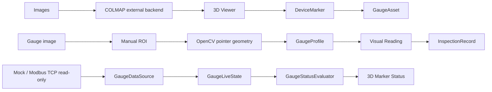

# Three-Dimensional Vision Inspection Platform

## A C++/Qt desktop platform for visual inspection and 3D state management of equipment

[中文](README.md) | English

This is a C++17, Qt Widgets, OpenGL and OpenCV desktop engineering project. It connects multi-view images, an external COLMAP reconstruction, 3D device markers, gauge assets, visual readings and live status into one traceable workflow.

`v0.3.0` is the **Gauge Inspection & Realtime Monitoring** release. It publishes the formal GaugeAsset domain, manual-ROI visual gauge reading, InspectionRecord, status rules, Mock Sensor and read-only Modbus TCP data-source implementations, while preserving the `v0.2.0` 3D viewer, camera interaction, mesh picking and DeviceMarker capabilities.

## Product workflow



## v0.3.0 scope

### GaugeAsset and 3D device binding

- `GaugeAsset` binds to the source-world position of an existing `DeviceMarker`.
- The example gauge is `P01 Inlet Pressure Gauge`, with a `0.0–2.5 MPa` range.
- The domain supports `Manual`, `Visual` and `Sensor` data sources.
- Gauge assets, status rules, data-source bindings and inspection records are persisted in the project JSON; live samples remain runtime state until explicitly recorded.

### Manual-ROI visual gauge reading

Visual reading is an explicit human-confirmation workflow, not AI, YOLO or fully automatic recognition:

1. Select a project image or an external image.
2. Draw the ROI manually.
3. Use OpenCV circle/pointer geometry to obtain a candidate reading.
4. Map pointer geometry to an engineering value with multi-point `GaugeProfile` interpolation.
5. Review the overlay and confirm the reading.

Visual inspection records retain the original `ImageAsset` binding together with the image, ROI, angle, reading and source information.

### InspectionRecord and history

- Manual, visual and sensor readings share the `InspectionRecord` representation.
- The client can display gauge history and the current source, timestamp and status.
- Live samples are not written to the project file automatically; recording the current value explicitly creates a persisted inspection record.

### GaugeStatus and 3D status visualization

- Status rules produce `Unknown`, `Normal`, `Warning` and `Alarm`.
- 3D markers use gray, green, yellow and red respectively.
- A selected marker remains visually distinguishable and is not hidden by the status color.

### Realtime data sources

- `GaugeDataSource`, `GaugeSample`, `GaugeLiveState` and `RealtimeMonitoringController` separate acquisition, live state and history.
- `MockSensorDataSource` supports local demonstrations and client smoke runs.
- `ModbusTcpGaugeDataSource` is a generic **read-only** Qt SerialBus adapter. It issues read requests only and exposes no PLC control or write API.
- Modbus binding supports Holding/Input Registers, `UInt16`, `Int16`, `UInt32`, `Int32`, `Float32`, `ABCD/CDAB` word order, scale/offset and polling interval.
- The Modbus source was validated in a local `QModbusTcpServer` loopback environment. It was not validated against a real PLC.

## Runtime screenshots

All images below are real captures from the Qt client. The new v0.3.0 captures were cropped to remove local paths and retain only the functional UI. The realtime capture is explicitly a Mock Sensor demonstration, not a Modbus client screenshot.

### OpenGL 3D Viewer


### Device Marker


### Marker Interaction


### Manual ROI visual gauge reading


### Inspection history and persisted gauge state


### Alarm marker state


### Realtime monitoring with Mock Sensor


## Core implementation

### C++ / Qt / OpenCV

- C++17 and CMake 3.21+.
- Qt 6 Widgets, OpenGL, OpenGLWidgets, Network, SerialBus and Qt Test.
- Qt SerialBus requires the matching Qt SerialPort dependency provided by the selected distribution; no Qt binaries are shipped here.
- OpenCV 4.x `core`, `imgproc` and `imgcodecs` modules.
- OpenGL 3.3 Core, GLSL 330, VAO/VBO/EBO.

### 3D and device domain

- Controlled Binary Little Endian PLY loader and CPU-side `MeshData`.
- Separate `MeshRenderer` and `MarkerRenderer`; CPU mesh data supports picking while GPU resources render the scene.
- `CameraController` provides Orbit, Pan, Zoom, Fit To View and Reset View.
- Triangle picking returns `SurfaceHit` and is currently a click-level CPU brute-force MVP.
- `DeviceMarker` persists source-world coordinates and reconstruction identity, rather than treating screen coordinates as business data.

### Vision, records and realtime runtime

- `GaugeProfile`, `VisualGaugeReader` and the manual-ROI dialog form the visual reading path.
- `InspectionRecord` unifies Manual, Visual and Sensor records and retains the original `ImageAsset` binding for visual records.
- `GaugeStatusRule` / `GaugeStatusEvaluator` convert readings or live samples into status values.
- `GaugeLiveState` holds the current live sample and connection state; only an explicit snapshot enters persisted history.
- COLMAP remains an external reconstruction backend and is not distributed here.

## Project structure

```text
app/
├─ src/core/assets/       # Image assets and thumbnails
├─ src/core/device/       # DeviceMarker, GaugeAsset, GaugeProfile and status rules
├─ src/core/inspection/   # InspectionRecord
├─ src/core/realtime/     # Mock/Modbus sources, live state and controller
├─ src/core/vision/       # VisualGaugeReader
├─ src/core/mesh/         # MeshData and PLY loading
├─ src/core/geometry/     # Ray, picking and SurfaceHit
├─ src/core/viewer/       # CameraController
├─ src/render/            # MeshRenderer and MarkerRenderer
├─ src/widgets/           # Qt Widgets, gauge dialogs and 3D viewer
└─ tests/                 # Qt Test targets
docs/images/              # Real client screenshots
```

## Build

### Requirements

- Windows 10 or newer.
- Visual Studio 2022 / MSVC.
- Qt 6.5 or a compatible Qt 6 distribution providing at least Core, Gui, Widgets, OpenGL, OpenGLWidgets, Network, SerialBus, SerialPort and Test.
- OpenCV 4.x. CMake must be able to find the directory containing `OpenCVConfig.cmake` through `OpenCV_DIR`; the project uses `core`, `imgproc` and `imgcodecs`.
- CMake 3.21+.
- COLMAP as an optional external reconstruction backend; it is not distributed here.

### Configure, build and test

Run from the repository root. The placeholders below refer to dependencies installed on the user's machine and are not fixed project paths:

```powershell
cmake -S app -B build -G "Visual Studio 17 2022" -A x64 -DCMAKE_PREFIX_PATH="<path-to-Qt-6>" -DOpenCV_DIR="<path-to-opencv-config-directory>" -DBUILD_TESTING=ON -DVISION3DINSPECTOR_BUILD_TESTS=ON
cmake --build build --config Release --target ALL_BUILD
ctest --test-dir build -C Release --output-on-failure
```

For a direct CTest run, make sure the matching Qt `bin` directory and OpenCV runtime `bin` directory are available on the current process `PATH`, or run from a development environment that has configured the Qt runtime. The maintainer release validation uses Qt 6.5.3 / MSVC and OpenCV 4.14, and the public repository actually passed **20/20 CTest tests**. Qt/OpenCV installers, runtime DLLs, COLMAP binaries, datasets, PLY meshes, model weights and reconstruction outputs are not committed.

## Current limitations and honest boundaries

- The current test model may contain mesh holes; 3D quality depends on capture and COLMAP reconstruction quality.
- Mesh picking remains click-level CPU brute-force; BVH acceleration is not implemented.
- Visual gauge reading requires a manual ROI and confirmation. It is an OpenCV pointer-geometry MVP, not an AI/YOLO/fully automatic gauge-reading system.
- A small tuned development regression set is not an independent validation benchmark; it is not used to claim general, 100% or industrial metrology accuracy.
- The Modbus TCP adapter is read-only and was validated only with a local Qt `QModbusTcpServer` loopback; real PLCs, PLC write/control, Siemens/S7 and MQTT are outside this release.
- Without physical-scale calibration, world coordinates are reconstruction coordinates, not millimeter-accurate physical coordinates.
- The UI remains Qt Widgets; QML modernization, an installer and commercial deployment are outside this release.

The 3D module provides a foundation for spatial management, position binding and status visualization. Gauge and realtime results should be used within the validation boundaries stated above.

## Public boundary and license

This repository publishes the formal C++/Qt source, necessary public technical notes and real client screenshots only. It does not contain personal paths, tokens, passwords, credentials, API keys, datasets, PLY meshes, training weights, caches, build artifacts or third-party binary packages.

The project is licensed under Apache License 2.0; see [LICENSE](LICENSE). Third-party dependency and distribution boundaries are documented in [THIRD_PARTY_NOTICES.md](THIRD_PARTY_NOTICES.md).
